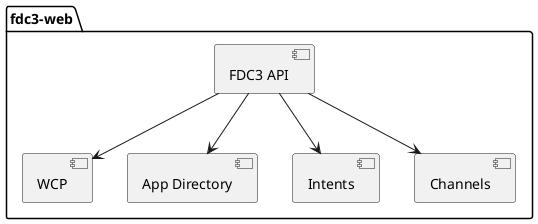
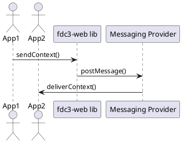
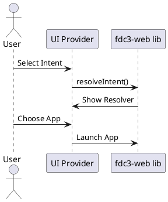

# ARCHITECTURE

This document provides an overview of the architecture for the `fdc3-web` library and its associated modules. The project is organized into three main modules:

- [Main Library (`lib`)](#main-library-lib)
- [Messaging Provider (`messaging-provider`)](#messaging-provider)
- [UI Provider (`ui-provider`)](#ui-provider)

---

## Main Library (`lib`)

The core of the `fdc3-web` project is the `lib` module, which implements the [FDC3 specification](https://fdc3.finos.org/docs/spec) for web environments. It provides the following key features:

- **FDC3 API Implementation**: Implements the FDC3 Desktop Agent API, including context, intents, channels, and app directory.
- **Web Communication Protocol (WCP)**: Built-in support for the [FDC3 WCP protocol](https://fdc3.finos.org/docs/spec/latest/wcp/), enabling cross-frame, and cross-origin communication.
- **Timeouts and Constants**: Centralized configuration for timeouts and other operational constants (see `src/constants.ts`).
- **App Directory**: Provides an interface and implementation for discovering and resolving applications (see `src/app-directory/`).

### Main Library Overview

---

## Messaging Provider

The `messaging-provider` module implements the FDC3 messaging provider interface, enabling communication between browser frames and windows, including across domains. **Note:** This module is _not required_ by consuming applications, as the main library already includes a built-in WCP-based connectivity layer.

- **Purpose**: To provide an alternative messaging mechanism for testing iframe connectivity.

### Messaging Provider Sequence

---

## UI Provider

The `ui-provider` module supplies UI components for FDC3 workflows:

- **Intent Resolver**: Presents users with options to resolve intents to applications. _Note: The resolver UI is only shown in the main browser window._
- **Channel Selector**: Allows users to select and join FDC3 channels.
- **Theming**: Supports theming for integration with host applications.
- **Intended Usage**: Designed for embedding in web applications that require user-driven intent resolution and channel selection. Not suitable for use in background frames or popups.
- **Limitations**: UI elements are only rendered in the main window; background or hidden frames will not display UI.

### PlantUML: UI Provider Flow

---

## Further Reading
- [FDC3 Specification](https://fdc3.finos.org/docs/spec)
- [FDC3 WCP Protocol](https://fdc3.finos.org/docs/spec/latest/wcp/)
- [FDC3 App Directory](https://fdc3.finos.org/docs/spec/latest/app-directory/)

For more details, see the respective module documentation in the `projects/` directory.
